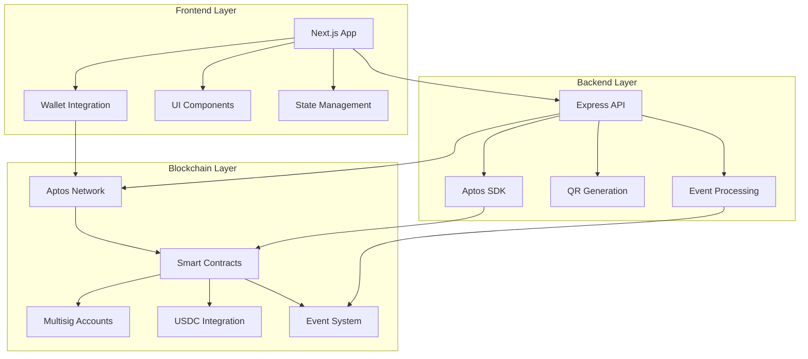

<div align="center">

# 💸 Bill Split Aptos

### **Revolutionary Web3 Bill Splitting on Aptos Blockchain**

[](https://aptoslabs.com/)
[](https://move-language.github.io/)
[](https://nextjs.org/)
[](https://www.typescriptlang.org/)

**Split bills with friends using blockchain technology - No more awkward money transfers!**

[🚀 Live Demo](#-live-demo) • [📖 Features](#-features) • [🛠️ Tech Stack](#️-tech-stack) • [⚡ Quick Start](#-quick-start) • [📱 Screenshots](#-screenshots)

---

</div>

## 🌟 What is Bill Split Aptos?

Bill Split Aptos is a **next-generation Web3 application** that revolutionizes how friends split bills using the power of blockchain technology. Built on the Aptos blockchain, it leverages native multisig accounts and smart contracts to create a seamless, transparent, and secure bill-splitting experience.

### 🎯 **The Problem We Solve**
- ❌ **Awkward money transfers** between friends
- ❌ **Complex calculations** for splitting bills
- ❌ **Trust issues** with who owes what
- ❌ **Manual tracking** of payments
- ❌ **Currency conversion** headaches

### ✅ **Our Solution**
- 🔐 **Blockchain-powered transparency** - Every transaction is verifiable
- 🤝 **Native multisig integration** - Secure group approvals
- 💰 **USDC stablecoin payments** - No volatility, just stability
- 📱 **QR code sharing** - Easy session joining
- ⚡ **Real-time updates** - Instant payment confirmations
- 🎨 **Beautiful UI** - Modern, intuitive design

---

## 🚀 Features

### 🔥 **Core Features**

<table>
<tr>
<td width="50%">

#### 💳 **Smart Bill Management**
- Create bill sessions with custom descriptions
- Add unlimited participants
- Automatic amount calculations
- Real-time status tracking
- QR code generation for easy sharing

</td>
<td width="50%">

#### 🔐 **Blockchain Security**
- Aptos native multisig accounts
- Smart contract-based logic
- Immutable transaction history
- Decentralized verification
- No single point of failure

</td>
</tr>
<tr>
<td width="50%">

#### 💰 **Payment Processing**
- USDC stablecoin integration
- Automatic payment distribution
- Real-time balance updates
- Transaction history tracking
- Gas-optimized operations

</td>
<td width="50%">

#### 📱 **User Experience**
- Modern, responsive design
- Wallet integration (Petra & Martian)
- Mobile-first approach
- Dark/light theme support
- Intuitive navigation

</td>
</tr>
</table>

### 🎨 **Advanced Features**

<details>
<summary><strong>🔧 Technical Excellence</strong></summary>

- **Scalable Architecture**: Supports 5-1000+ participants
- **O(1) Lookups**: Hash table optimization for large groups
- **Batch Operations**: Process multiple signatures efficiently
- **Event-Driven**: Real-time frontend/backend synchronization
- **Mock Mode**: Complete local testing without blockchain deployment
- **Type Safety**: Full TypeScript implementation
- **Error Handling**: Comprehensive error management and user feedback

</details>

<details>
<summary><strong>🎯 Smart Contract Features</strong></summary>

- **Native Multisig**: Leverages Aptos MultiEd25519 signatures
- **Flexible Signatures**: Custom signature requirements per session
- **Status Management**: 5-stage bill lifecycle (Created → Approved → Settled)
- **Participant Tracking**: Individual payment and signature status
- **Event Emission**: Real-time blockchain events for UI updates
- **Gas Optimization**: Efficient Move code for minimal transaction costs

</details>

---

## 🛠️ Tech Stack

### **🔗 Blockchain & Smart Contracts**
- **Aptos Blockchain** - High-performance, secure blockchain
- **Move Language** - Resource-oriented smart contract language
- **Native Multisig** - Aptos MultiEd25519 signature scheme
- **USDC Integration** - Stablecoin for reliable payments

### **💻 Frontend**
- **Next.js 15** - React framework with App Router
- **TypeScript** - Type-safe development
- **Tailwind CSS** - Utility-first styling
- **Framer Motion** - Smooth animations
- **Lucide React** - Beautiful icons
- **Radix UI** - Accessible components

### **⚙️ Backend**
- **Node.js** - JavaScript runtime
- **Express.js** - Web framework
- **Aptos SDK** - Blockchain integration
- **QR Code Generation** - Easy session sharing

### **🔧 Development Tools**
- **ESLint** - Code linting
- **Prettier** - Code formatting
- **Husky** - Git hooks
- **Jest** - Testing framework

---

## ⚡ Quick Start

### **Prerequisites**
- Node.js 18+ 
- npm or yarn
- Aptos wallet (Petra or Martian)
- Git

### **🚀 Installation**

```bash
# Clone the repository
git clone https://github.com/your-username/bill-split-aptos.git
cd bill-split-aptos

# Install frontend dependencies
cd frontend
npm install

# Install backend dependencies
cd ../backend
npm install

# Install contract dependencies
cd ../contracts
# (Move dependencies are handled automatically)
```

### **🏃‍♂️ Running the Application**

#### **Option 1: Mock Mode (Recommended for Testing)**
```bash
# Start frontend in mock mode
cd frontend
npm run dev

# Open http://localhost:3000
# Everything works without blockchain deployment!
```

#### **Option 2: Full Blockchain Mode**
```bash
# Deploy smart contracts
cd contracts
aptos move publish --network devnet

# Start backend
cd ../backend
npm run dev

# Start frontend
cd ../frontend
npm run dev
```

### **🔗 Environment Setup**

Create `.env` files in both `frontend` and `backend` directories:

```env
# Frontend .env
NEXT_PUBLIC_APTOS_NODE_URL=https://fullnode.devnet.aptoslabs.com/v1
NEXT_PUBLIC_APTOS_CONTRACT_ADDRESS=0x_your_contract_address

# Backend .env
APTOS_NODE_URL=https://fullnode.devnet.aptoslabs.com/v1
APTOS_FAUCET_URL=https://faucet.devnet.aptoslabs.com
APTOS_PRIVATE_KEY=your_private_key
APTOS_CONTRACT_ADDRESS=0x_your_contract_address
```

---

## 📱 Screenshots

<div align="center">

### **🏠 Home Dashboard**

*Clean, modern interface with wallet connection and quick stats*

### **💳 Bill Creation**

*Intuitive bill creation with participant management*

### **👥 Participant Management**

*Easy participant addition and signature collection*

### **💰 Payment Processing**

*Secure payment processing with real-time updates*

### **📊 Session Overview**

*Comprehensive session tracking and status management*

</div>

---

## 🎮 How It Works

### **1. 📝 Create a Bill Session**
- Enter bill description and total amount
- Add participant addresses and names
- Generate QR code for easy sharing
- Smart contract creates multisig account

### **2. 👥 Participants Join**
- Scan QR code or enter session ID
- Participants are automatically added
- Individual amounts calculated and displayed
- Real-time status updates

### **3. ✍️ Sign Agreement**
- Each participant signs the bill agreement
- Multisig signatures collected on-chain
- Session approved when threshold reached
- Transparent, verifiable process

### **4. 💰 Make Payments**
- Participants pay their share in USDC
- Automatic payment distribution to merchant
- Real-time balance and status updates
- Complete transaction history

### **5. ✅ Settlement**
- All payments collected automatically
- Session marked as settled
- Final transaction confirmation
- Receipt generation

---

## 🏗️ Architecture



---

## 🧪 Testing

### **Mock Mode Testing**
```bash
# Start in mock mode
cd frontend
npm run dev

# Test scenarios:
# 1. Create bill session
# 2. Add participants
# 3. Sign agreements
# 4. Process payments
# 5. Verify settlement
```

### **Blockchain Testing**
```bash
# Deploy to testnet
cd contracts
aptos move publish --network testnet

# Run test suite
aptos move test --network testnet

# Test with real wallets
# Use testnet APT from faucet
```

---

## 🚀 Deployment

### **Smart Contracts**
```bash
# Deploy to mainnet
cd contracts
aptos move publish --network mainnet

# Verify deployment
aptos account list --network mainnet
```

### **Frontend**
```bash
# Build for production
cd frontend
npm run build

# Deploy to Vercel/Netlify
npm run deploy
```

### **Backend**
```bash
# Deploy to cloud provider
cd backend
npm run build
npm start
```

---

## 🤝 Contributing

We welcome contributions! Here's how you can help:

### **🐛 Bug Reports**
- Use GitHub Issues
- Include steps to reproduce
- Provide error logs and screenshots

### **💡 Feature Requests**
- Describe the feature clearly
- Explain the use case
- Consider implementation complexity

### **🔧 Code Contributions**
1. Fork the repository
2. Create a feature branch
3. Make your changes
4. Add tests if applicable
5. Submit a pull request

### **📖 Documentation**
- Improve README sections
- Add code comments
- Create tutorials or guides

---

## 📄 License

This project is licensed under the MIT License - see the [LICENSE](LICENSE) file for details.

---

## 🙏 Acknowledgments

- **Aptos Labs** - For the amazing blockchain platform
- **Move Language Team** - For the powerful smart contract language
- **Open Source Community** - For the incredible tools and libraries
- **Beta Testers** - For valuable feedback and bug reports

---

## 📞 Support & Community

- **Discord**: [Join our community](https://discord.gg/your-discord)
- **Twitter**: [@BillSplitAptos](https://twitter.com/billsplitaptos)
- **Email**: support@billsplitaptos.com
- **GitHub Issues**: [Report bugs or request features](https://github.com/your-username/bill-split-aptos/issues)

---

<div align="center">

### **⭐ Star this repository if you found it helpful!**

**Built with ❤️ by the Bill Split Aptos Team**

[](https://github.com/your-username/bill-split-aptos)
[](https://github.com/your-username/bill-split-aptos)
[](https://github.com/your-username/bill-split-aptos)

</div>